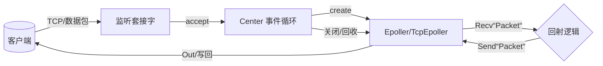
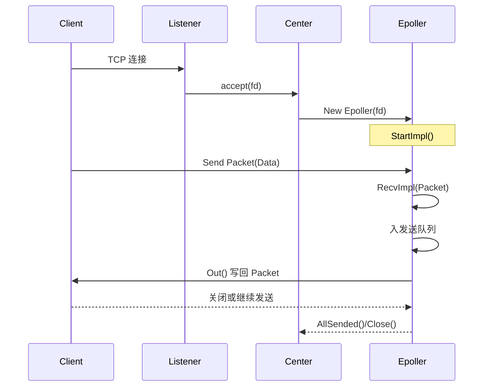
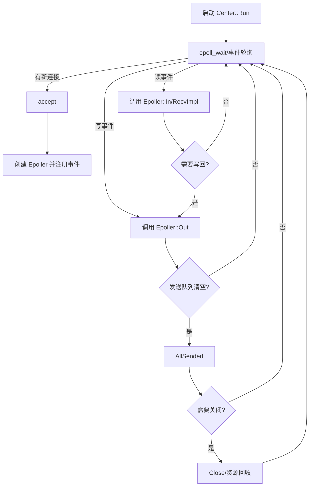
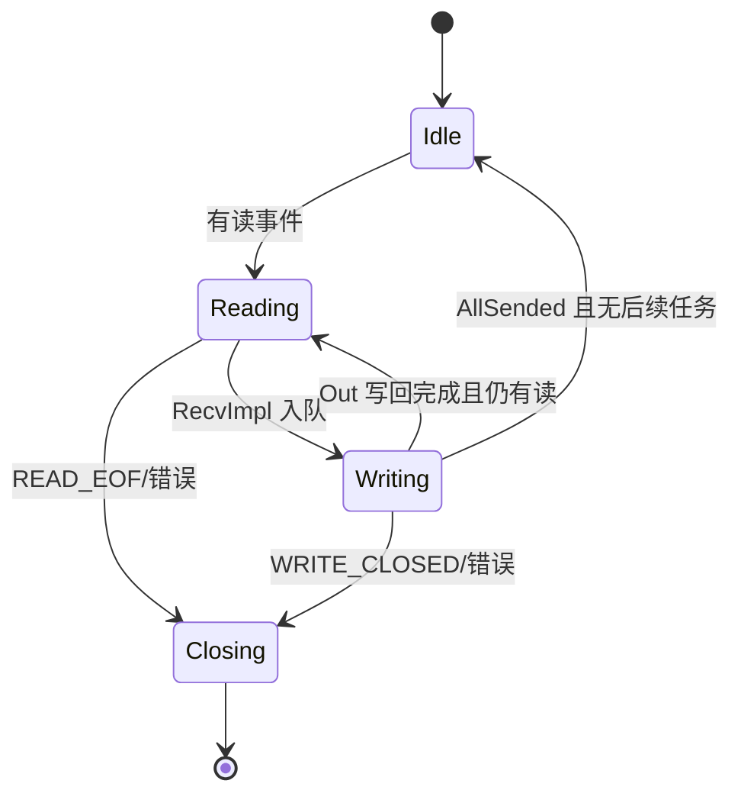

# echo_server_code
## 回射服务器实现说明

### 一、总体架构设计

- **目标**：实现一个回射（Echo）服务器，接受客户端发来的数据并原样返回。
- **架构风格**：事件驱动（Epoll）+ 面向连接的 `Epoller` 抽象 + `Center` 主循环。
- **核心组件**：
    - `Center`：负责监听、接入连接、事件轮询与资源回收。
    - `Epoller`/`TcpEpoller`/`AutoFlagTcpEpoller`：单连接读写与发送队列管理。
    - `PacketHeader`/`Packet`/`Data`：统一的报文与负载格式。
- **回射逻辑**：在服务器侧 `Epoller::RecvImpl(Packet)` 收到数据后，将收到的 `Packet` 原样（或构造 `DEFAULT` 命令的 `Packet`）放入发送队列，`Out` 时写回客户端。

### 二、关键数据结构设计

- `PacketHeader`（见 `src/common/packet_header.h`）
    - 字段：`command`、`length`、`error`、`extra1`、`extra2`（`uint32_t`）。
    - 基础命令：`DEFAULT(9)` 可作为回射的数据包命令；也支持 `ACK/ERROR/READ_EOF/WRITE_CLOSED`。
- `Data`（见 `src/common/data.h`）
    - 承载负载数据（长度 + 指针），支持拷贝/移动。
- `Packet`（见 `src/common/packet.h`）
    - `Packet(header, data)` 组合，支持 `Send()` 排入发送队列，由 `TcpEpoller` 在 `Out()` 写回。

回射最小闭环只需 `DEFAULT` 命令与 `Data` 负载；若要可选 `ACK`/`ERROR` 也可沿用基础协议。

### 三、关键流程图（文字描述）

1) 服务器启动
- 创建 `EchoServerCenter`（可直接使用 `EpollCenter` 的默认 echo 实现，或派生自 `Center`）。
- 绑定并监听端口 → `Center::Run()` 进入事件循环。

2) 新连接接入
- `Center` 在 `accept` 后创建 `EchoEpoller`（派生自 `AutoFlagTcpEpoller`）。
- `EchoEpoller::StartImpl()` 可为空（回射无需握手）。

3) 回射处理
- `EchoEpoller::RecvImpl(Packet packet)`：
    - 若 `packet.header.command == PacketHeaderCommand::DEFAULT`（或任意数据包）：
        - 直接 `Send(packet.Ack())`（可选）或 `Send(packet)`（原样回射）。
    - 若收到 `READ_EOF/WRITE_CLOSED`：交给基类处理关闭；必要时清理资源。

4) 发送与关闭
- `TcpEpoller::Out()` 将发送队列写入 socket；当队列与写缓冲清空时调用 `AllSended()`，若连接已无后续任务则 `Close()`。

### 四、实现步骤（建议）

1) 入口与构建
- 在 `src/server/` 新增或复用 `server_main.cc`：创建 `EpollCenter` 或 `EchoServerCenter`，打开监听端口，调用 `Run()`。

2) 服务器 Epoller（若需要自定义行为）
- 新建 `echo_server_epoller.h/.cc`，类派生自 `AutoFlagTcpEpoller`，实现：
    - `RecvImpl(Packet packet)`：将收到的 `packet` 原样 `Send(std::move(packet))`（或构造 `DEFAULT` 命令的 `Packet`）。
    - `AllSendedImpl()`：无需特殊逻辑（回射是流式，通常不主动关，除非协议约定）。

3) Center（按需）
- 若默认 `EpollCenter` 已实现 echo，直接使用；否则新建 `echo_server_center.h/.cc`：
    - 覆写 `NewConnectionEpoller(int fd)` 返回 `EchoServerEpoller`。

4) 客户端（验证）
- 复用已有 `client_main` 或编写简单客户端：连接服务器、以 `DEFAULT` 命令发送若干 `Packet`，校验返回 `Data` 是否一致。

5) 运行与验证
- 启动服务器 → 启动客户端 → 观察回射是否一致与吞吐/时延表现。

### 五、注意事项

- 非阻塞 IO：保持 `AutoFlagTcpEpoller` 自动管理 `WantOut`，避免写半包卡顿。
- 报文长度一致性：`PacketHeader.length` 与 `Data.length()` 建议一致，便于对端校验与内存分配。
- 关闭时机：在客户端主动断开或错误发生时，允许 `TcpEpoller` 完成余量发送再关闭。


### 六、快速开始

- 环境要求：
    - **CMake** ≥ 3.16
    - **C++ 编译器**（GCC/Clang/MSVC，支持 C++17）
- 获取代码：
    - `git clone` 或直接下载本仓库
- 构建步骤（以默认 `CMakeLists.txt` 为例）：
    1. 在项目根目录创建并进入构建目录：
        ```bash
        mkdir -p cmake-build-debug && cd cmake-build-debug
        ```
    2. 生成构建文件：
        ```bash
        cmake -DCMAKE_BUILD_TYPE=Debug ..
        ```
    3. 编译：
        ```bash
        cmake --build . --config Debug -j
        ```
    4. 运行服务器和客户端：
        ```bash
        # 启动服务器（默认监听8888端口）
        ./bin/echo_server
        
        # 在另一个终端运行客户端
        ./bin/echo_client
        ```


### 七、项目结构

```text
echo_server_code/
├─ CMakeLists.txt            # CMake 构建脚本
├─ main.cpp                  # 入口（示例）
├─ README.md                 # 项目说明（本文件）
└─ cmake-build-debug/        # 构建产物（示例目录）
```


### 七点五、项目骨架（建议目录）

```text
echo_server_code/
├─ CMakeLists.txt
├─ README.md
├─ main.cpp
├─ include/
│  ├─ common/
│  ├─ net/
│  └─ core/
├─ src/
│  ├─ common/
│  ├─ net/
│  ├─ core/
│  ├─ server/
│  └─ client/
├─ examples/
├─ tests/
│  ├─ unit/
│  └─ integration/
├─ scripts/
├─ cmake/
│  └─ modules/
└─ cmake-build-debug/
```


### 八、架构概览

核心范式：单线程事件驱动（Reactor/epoll），以“事件多路复用 + 面向连接的处理单元（Epoller）”为中心。
组件边界与职责：
Listener（监听套接字）：负责被动接入（accept），不参与业务处理。
Center（事件中心）：封装 epoll_wait 轮询与事件分发，承担连接生命周期管理与资源回收。
Epoller/TcpEpoller（连接处理器）：面向单连接的协议处理与 I/O 编排，维护发送队列与 WantOut 状态。
Packet/PacketHeader/Data（数据模型）：显式分层的协议载体，解耦编解码、路由与数据承载。
关键设计原则：
边沿触发/水平触发下的“非阻塞 I/O + 小步快跑”（有限搬运）策略，避免写阻塞与惊群。
写关注按需开启（WantOut），以降低空转占用。
处理单元内聚（每连接一个 Epoller），全局状态仅在 Center 管辖，降低耦合。




### 九、收发回路

输入路径（RX）：
epoll_wait 返回可读事件 → TcpEpoller::In() 读取字节流 → 基于帧边界/长度组装 Packet → 上行至 RecvImpl(Packet)。
业务处理（Echo 逻辑）：
RecvImpl 对 DEFAULT 或通用命令执行“零拷贝/最少拷贝”的入队转发：Send(std::move(packet))。
可选：对 ACK/ERROR/EOF 等命令执行状态管理或上报。
输出路径（TX）：
Send() 将 Packet 入本地发送队列并置位 WantOut → 触发 epoll 写关注。
TcpEpoller::Out() 执行多次非阻塞 write/send，直至发送队列与内核缓冲满足水位策略；全部清空后调用 AllSended() 并撤销写关注。
可靠性与背压：
通过分段发送与队列水位（可扩展）抵抗上游突发；在上游持续快于下游时维持队列有界，必要时触发降载策略。




### 十、事件循环

主循环职责：
初始化监听套接字与 epoll 实例；注册监听 fd（EPOLLIN）。
常驻循环中执行 epoll_wait，将触发的事件分派至对应 Epoller。
事件分类与处理流程：
接入事件：监听 fd 可读 → accept → 创建 Epoller 实例 → 将客户端 fd 以 EPOLLIN 注册。
读事件：客户端 fd 可读 → 调 Epoller::In() → 解析帧 → RecvImpl()。
写事件：客户端 fd 可写且 WantOut==true → 调 Epoller::Out() → 队列清空则撤销 EPOLLOUT。
错误/挂断：EPOLLERR/EPOLLHUP → 进入关闭路径，释放资源并从 epoll 注销。
性能与可扩展性要点：
线程模型可扩展为 N-Reactor：多 Center/epoll 实例按 fd 哈希或 CPU 亲和度分片。
任务边界清晰（Center 调度、Epoller I/O），便于后续接入线程池处理重计算业务。




### 十一、Epoller 状态机

状态定义：
Idle：未挂起 I/O 操作，等待事件（通常仅关心 EPOLLIN）。
Reading：处理可读事件，汇聚字节流至完整 Packet；错误/EOF 落入 Closing。
Writing：处理可写事件，将发送队列刷至对端；全部发送完转移至 Idle 或 Reading。
Closing：进入资源回收阶段，注销事件、关闭 fd，回收缓冲区。
状态迁移（典型）：
Idle → Reading：收到读事件。
Reading → Writing：RecvImpl 产出待发送数据并 Send 入队，开启写关注。
Writing → Reading/Idle：写清队列后，依据是否仍需读继续保持 EPOLLIN，撤销 EPOLLOUT。
Reading/Writing → Closing：EPOLLERR/EPOLLHUP/EOF 或协议驱动关闭。
关键不变式与策略：
写关注“只在需要时开启”：发送队列为空时必须撤销 EPOLLOUT，以避免 busy polling。
读写均为非阻塞，保证单线程 Reactor 的进展性。
发送队列元素必须是协议语义完整的 Packet，以保证对端可正确解析帧边界。
需要的话，我可以把上述“专业术语版”精炼为 README.md 的四个小节下的“说明”子章节，并与 Mermaid 图保持一致的术语对齐。




